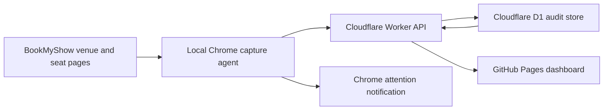

# High-level architecture and decisions

## Why the earlier approach was unreliable

The previous tracker mixed a static GitHub Pages snapshot, scheduled GitHub Actions, several third-party showtime proxy hosts, a Cloudflare Worker, a Vercel proxy and aggregate fallback data. Its final box-office job also captured Sri Krishna roughly three minutes before cutoff in some paths. That creates four practical failure modes:

1. GitHub Actions schedules can start late, so they cannot guarantee a 7:14 AM capture.
2. A static JSON file is publication storage, not a durable event database.
3. Third-party aggregate fallbacks cannot reliably identify a particular theatre session.
4. A movie replacement at the same time can be confused with the earlier movie without revisioned session identity.

The new tracker removes third-party data sources from the counting path. BookMyShow is discovered with the user's normal local Chrome session; the final seat state comes from BookMyShow's accessibility seat map; Cloudflare D1 is the system of record.

## Components



### Discovery

The local Chrome agent refreshes today's Sri Krishna page every five minutes, tomorrow's page hourly, and performs a final preflight 90 seconds before capture. It parses the embedded `window.__INITIAL_STATE__`, which provides the event code, movie, session ID, show time, prices and BookMyShow cutoff.

Discovery is deliberately lighter than seat counting. Seat layouts are opened only in the final-minute window.

### Show identity and replacement handling

Two identities are stored:

- slot: `venue + date + show time`
- revision: `slot + session ID + event code`

When the slot remains 6:00 PM but the event/session changes, the old revision is marked `replaced`, the new revision becomes current, and a `schedule_events` audit row links them. If a show disappears with no replacement, it is marked `removed`.

### Final capture

`capture_at = CutOffDateTime - 1 minute`. For the user's 7:00 AM example:

- start: 7:00:00
- capture window opens: 7:14:00
- BookMyShow cutoff: 7:15:00

The Chrome agent performs a venue-page preflight 90 seconds before the capture window, then starts the seat read about 15 seconds into the final minute. A failed read retries while the minute remains open. Once the cutoff passes, the newest successful snapshot becomes final.

### Calculation

For each category:

```text
sold = capacity - available
counted ticket price = max(live listed price - ₹5, ₹0)
category collection = sold × counted ticket price
```

The code uses integer paise to avoid floating-point money errors.

### Cloudflare and failure policy

Automated datacenter/headless browsers are frequently challenged or blocked by Cloudflare. The primary collector therefore runs as a Chrome extension on an always-on local computer, using a normal visible tab, stable browser profile and ordinary internet connection. It does not solve or bypass challenges. When verification is required, it raises a Chrome notification and waits for the user to complete the check.

- zero-seat layouts are rejected
- unknown seat states are rejected rather than silently counted
- failed captures retry until cutoff
- no successful final-minute capture becomes `missed`, not zero
- Chrome startup rebuilds the known preflight and capture alarms
- the Worker independently finalizes the latest valid snapshot after cutoff

## Hosting decision

GitHub Pages is correct for the frontend, but not for the collector. The chosen production layout is:

1. GitHub Pages for the static web app;
2. a free Cloudflare Worker plus D1 for the API, audit data and cutoff finalization;
3. an always-on local Mac/PC with Chrome and `apps/chrome-agent` loaded.

Cloudflare's one-minute cron is not used for the time-sensitive browser action. Chrome schedules the final read from BookMyShow's live cutoff, and the Worker only stores and finalizes the result. The older Express/PostgreSQL/Playwright service remains an optional self-hosted fallback, not the recommended deployment. For guaranteed unattended figures with no local collector, obtain an authorized BookMyShow/theatre partner feed.
