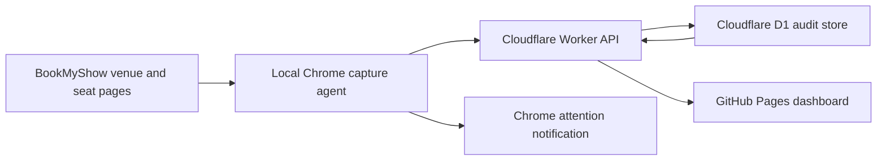

# High-level architecture and decisions

## Why the earlier approach was unreliable

The previous tracker mixed a static GitHub Pages snapshot, scheduled GitHub Actions, several third-party showtime proxy hosts, a Cloudflare Worker, a Vercel proxy and aggregate fallback data. Its final box-office job also captured Sri Krishna roughly three minutes before cutoff in some paths. That creates four practical failure modes:

1. GitHub Actions schedules can start late, so they cannot guarantee a 7:14 AM capture.
2. A static JSON file is publication storage, not a durable event database.
3. Third-party aggregate fallbacks cannot reliably identify a particular theatre session.
4. A movie replacement at the same time can be confused with the earlier movie without revisioned session identity.

The new tracker removes third-party data sources from the counting path. BookMyShow is discovered with the user's normal local Chrome session; the final seat state comes from BookMyShow's accessibility seat map; Cloudflare D1 is the system of record.

## Components



### Discovery

The local Chrome agent refreshes the four configured current India-date theatre pages every fifteen minutes and switches dates just after 12:00 AM IST. At rollover it discards only its own stale collector tabs and opens fresh current-date tabs. A tab that remains loading for 30 seconds, loses its content script, or returns an invalid page result is replaced once immediately. If the fresh tab also fails, only that theatre retries after 2, 5, then 15 minutes; successful discovery clears the failure state. Routine discovery pauses independently for a theatre after its final known show has a successful capture and passes cutoff. It never opens tomorrow's schedule early. Each theatre has an independent pinned tab and pending-capture job, so matching showtimes can be captured concurrently. It parses the booking platform's embedded state, which provides the event code, movie, session ID, show time, prices and booking cutoff.

Discovery is deliberately lighter than seat counting. Seat layouts normally open twice: once for the early backup and once for the final attempt.

### Show identity and replacement handling

Two identities are stored:

- slot: `venue + date + show time`
- revision: `slot + session ID + event code`

When the slot remains 6:00 PM but the event/session changes, the old revision is marked `replaced`, the new revision becomes current, and a `schedule_events` audit row links them. If a show disappears with no replacement, it is marked `removed`.

### Final capture

`capture_at` is the beginning of the protected capture window. For a 7:00 AM Sri Krishna show:

- start: 7:00:00
- backup window opens: 7:10:00
- final attempt: 7:14:00
- BookMyShow cutoff: 7:15:00

Ravi and ASR use showtime +15 minutes for their backups because their observed cutoffs are +20 minutes. The agent preflights before both the backup and final attempts. After a successful backup it waits for the final minute; after a failed backup it retries once per minute. Once cutoff passes, the newest successful snapshot becomes final. Every attempt and error is also written to the durable collector log.

For Sri Krishna, Ravi and ASR, the first failed BookMyShow page read switches only that show into recovery mode. The agent immediately refreshes that theatre's exact current-date session, preserves the normal retry schedule, prepares a separate active tab, and uses a state-aware reader that can resume from the category/row, ticket quantity, accessibility, or Select Seats stage rather than repeating one rigid interaction. A successful recovery becomes the protected backup; the final-minute attempt remains in recovery mode and can replace it. Recovery is cleared just after cutoff. Sai Chitra stays on its independent TicketNew flow and never enters this BookMyShow recovery mode.

### Calculation

For each category:

```text
sold = capacity - available
counted ticket price = max(live listed price - ₹5, ₹0)
category collection = sold × counted ticket price
```

The code uses integer paise to avoid floating-point money errors.

### Cloudflare and failure policy

Automated datacenter/headless browsers are frequently challenged or blocked by Cloudflare. The primary collector therefore runs as a Chrome extension on an always-on local computer, using a normal visible tab, stable browser profile and ordinary internet connection. It does not solve or bypass challenges. When verification is required, it raises a Chrome notification and waits for the user to complete the check.

- zero-seat layouts are rejected
- unknown seat states are rejected rather than silently counted
- failed backups retry once per minute until the final attempt
- a successful backup is preserved if the final attempt fails
- no successful capture becomes `missed`, not zero
- Chrome startup rebuilds the known preflight and capture alarms
- stuck extension-owned discovery tabs are replaced without closing unrelated user tabs
- the Worker independently finalizes the latest valid snapshot after cutoff

## Hosting decision

GitHub Pages is correct for the frontend, but not for the collector. The chosen production layout is:

1. GitHub Pages for the static web app;
2. a free Cloudflare Worker plus D1 for the API, audit data and cutoff finalization;
3. an always-on local Mac/PC with Chrome and `apps/chrome-agent` loaded.

Cloudflare's one-minute cron is not used for the time-sensitive browser action. Chrome schedules the final read from BookMyShow's live cutoff, and the Worker only stores and finalizes the result. The older Express/PostgreSQL/Playwright service remains an optional self-hosted fallback, not the recommended deployment. For guaranteed unattended figures with no local collector, obtain an authorized BookMyShow/theatre partner feed.
